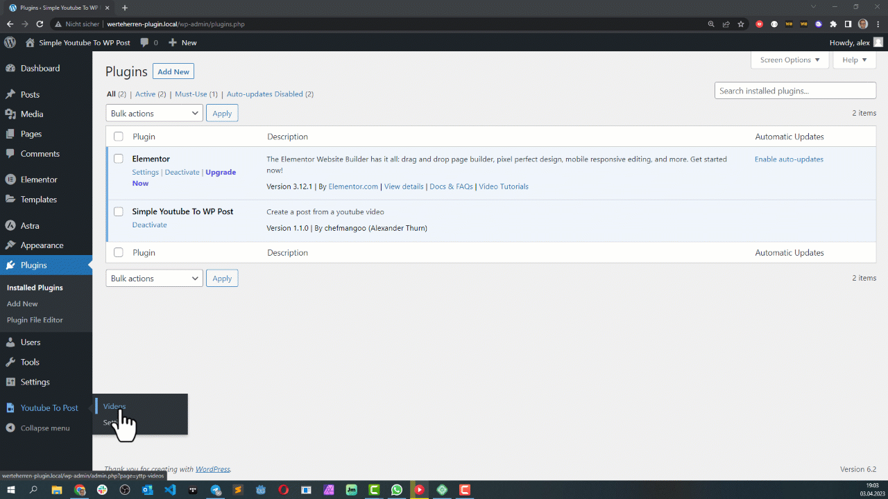
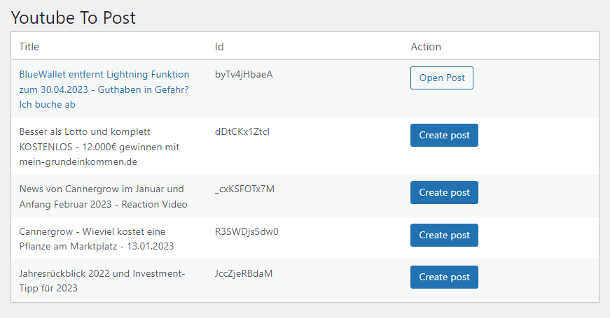
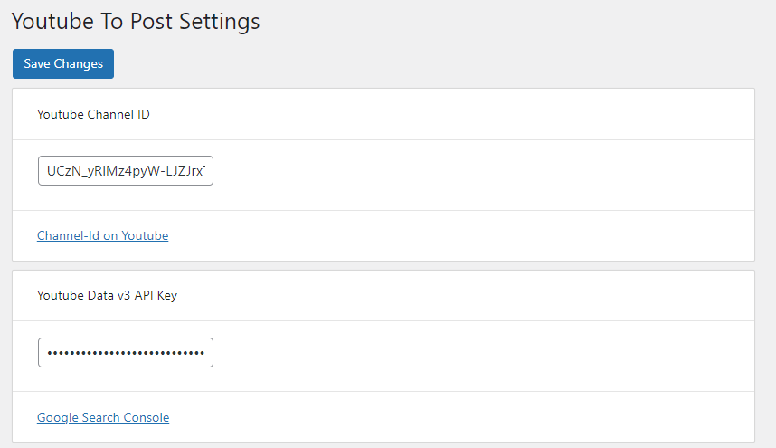
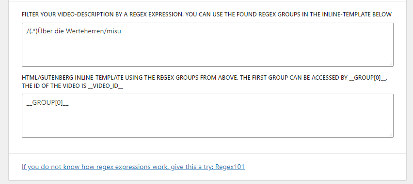

# Simple Youtube To WP Post 

## A plugin to create wordpress posts from youtube videos

Do you own a youtube channel <b>AND</b> a wordpress site?
Do you create videos and create posts based on them? maybe with a very similar description and a link to the video? 

**With this plugin you can create posts based on your youtube videos and modify them afterwards like usual**

## Features

* Simple one click creation of posts based on your youtube videos 
* Regular expressions to use only some parts of the video description
* Simple blog template in which you can define where the description of the video will be placed within the content of the post, gutenberg blocks are supported
* Extendable via action hook after post + attachment creation
* Converts youtube text to html (newlines, links are created)



## Getting started

* Install this plugin, e.g. copy it in the plugins directory. 
* Activate the plugin.
* Enter your Channel ID and your Api Key "YouTube Data API v3" in the settings.

More about

* Channel-ID: https://www.youtube.com/account_advanced
* Api-Key: https://console.cloud.google.com/apis/library/youtube.googleapis.com


## Development

The frontend is based on JSX. Therefore you need to have npm and node to change it

```
cd youtube-to-post
npm install
npm run start
```
### Post-Settings example

With post-settings you can define what part of the description will be taken and how it is placed within the post content. You can also define a page_template if needed.

**Regex**

```
/(.*)Über die Werteherren/misu
```

The contents in the round brackets are saved as regex-groups. The first () will be made available as __GROUP[0]__, the second () will be __GROUP[1]__. Additionally there is the __VIDEO_ID__ field, which contains the id of the video, e.g. to create a link to the original video. 

Those fields can be used in a configurable inline-template, which takes those values and can contain html and gutenberg markup code.

**Inline-Template**

```
    __GROUP[0]__
    <br />
    <iframe width="640" height="430" src="https://www.youtube.com/embed/__VIDEO_ID__"></iframe>
```
This would result in a blog post beginning with the description saved in __GROUP[0]__. It adds a newline and then an iframe showing the youtube video using the __VIDEO_ID__.


You can also use blocks in the template, e.g. to add a gutenberg table or video element

```
    <!-- wp:paragraph -->
    __GROUP[0]__
    <!-- /wp:paragraph -->

    <!-- wp:embed {"url":"https://www.youtube.com/embed/__VIDEO_ID__","type":"rich","providerNameSlug":"embed-handler","responsive":true,"className":"wp-embed-aspect-16-9 wp-has-aspect-ratio"} -->
    <figure class="wp-block-embed is-type-rich is-provider-embed-handler wp-block-embed-embed-handler wp-embed-aspect-16-9 wp-has-aspect-ratio"><div class="wp-block-embed__wrapper">
    https://www.youtube.com/embed/__VIDEO_ID__
    </div></figure>
    <!-- /wp:embed -->

```

**Page Template**

In case your theme supports page_templates for posts, you can define one. A page template is a .php file located in the theme directory, which will be used for the post instead of the default/single.php.

```
a-custom-page-template.php
```

## Hooks

There is one hook available namend **yttp_after_post_creation**, which is executed "after" post and attachment creation. 
It contains the success state, the post itself if created, the post_id and the attachment_id if set

Example

```

add_action('yttp_after_post_creation', 'yttp_after_post_creation_func');

    function yttp_after_post_creation_func($result) {
        error_log('hook test');
        error_log(print_r($result, true));
    }

    /*

        result:

            [03-Apr-2023 16:32:42 UTC] hook test
            [03-Apr-2023 16:32:42 UTC] Array
            (
                [success] => 1
                [post] => Array
                    (
                        [post_title] => This is a title
                        [post_content] => This is a content
                        [post_status] => draft
                        [post_author] => 1
                        [post_type] => post
                        [page_template] => single-custom.php
                    )

                [post_id] => 232
                [attachment_id] => 233
            )


    */

```

## Screenshots

List of youtube videos. One click on "Create post" creates a post with the description of the video as the content of the blog post and the thumbnail of the video as the featured image


This screenshot shows the mandatory settings (youtube channel-id and api key)


You can define which parts of the video description should be taken and how they should be outputted


## Author

[Alexander Thurn](https://github.com/alexanderthurn)

## TODO

* Better link extraction (t.me does not work)
* Add Elementor-Support: https://stackoverflow.com/questions/63898766/wordpress-programmatically-insert-elementor-widgets-in-a-page

## License

MIT

[](https://opensource.org/licenses/MIT)

